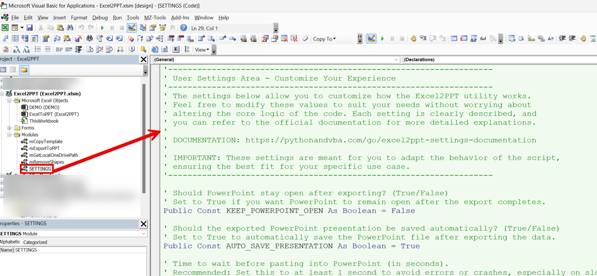

# How to Access additional Settings

To customize the settings of the Excel2PPT utility, you need to access the **SETTINGS** module in the Visual Basic for Applications (VBA) editor. Follow these steps to open and modify the settings:

1. **Enable the Developer Tab**
   * If you do not see the Developer tab in Excel, right-click on the ribbon and select **Customize the Ribbon**.
   * Check the box next to **Developer** and click **OK**. This will make the Developer tab visible in your Excel ribbon.
2. **Open the VBA Editor**
   * Go to the **Developer** tab and click on **Visual Basic**.
   * Alternatively, press **ALT + F11** to open the VBA editor directly.
3. **Navigate to the mSettings Module**
   * In the VBA editor, locate your workbook under **VBAProject**.
   * Expand the workbook and navigate to **Modules**.
   * Double-click on the module named **mSettings** to open it.
4. **Modify the Settings**
   * Once you have opened the **mSettings** module, you will see a list of configurable settings.
   * You can adjust these values to customize how the Excel2PPT tool functions.

<figure><figcaption></figcaption></figure>

For a more detailed explanation of each setting, please refer to the Customization Guide.
