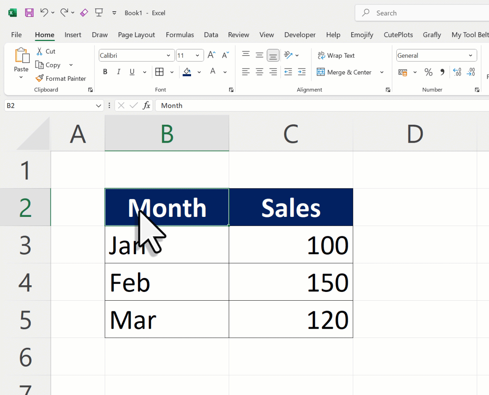

# How to Define Named Ranges for Export

Named ranges help specify the exact charts, tables, or data you want to export to PowerPoint using Excel2PPT. Follow these simple steps to create them:

#### Step 1: Select Your Cells

Click and drag to select the cells containing the chart, table, or data you want to export.

#### Step 2: Create a Named Range

1. Go to the **Name Box** in the top left (next to the formula bar).
2. Type a descriptive name for your range, like **rngSalesByCategory**, without spaces.
3. Press **Enter** to save it.

#### Step 3: Repeat for More Ranges

Repeat these steps for other charts, tables, or data ranges you want to export.

#### Step 4: Use Named Ranges in Excel2PPT

Use these named ranges in the export table of Excel2PPT to specify what gets exported and where it should go in PowerPoint.

#### Tips

* Use clear names to easily identify each range later.
* Prefix names (e.g., **rng**) to keep them organized.

**Demo Video:**

<figure><figcaption>
Create Named Ranges
</figcaption></figure>

